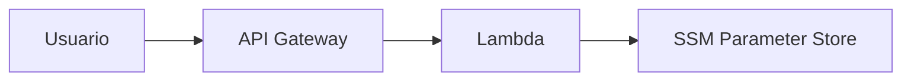

# AWS Dynamic String Challenge

## Descripción del Desafío

Crear un servicio en la nube que sirva una página HTML mostrando una cadena configurable dinámicamente **sin requerir redeploy** cuando la cadena cambie.

---

## Objetivo

- Servir una página HTML con el contenido:

```html
<h1>La cadena guardada es [valor_dinámico]</h1>
```

- El valor dinámico debe poder modificarse mediante configuración (sin cambios de código).
- Accesible mediante una URL pública.
- Todos los usuarios que accedan a la URL deben ver el mismo valor.
- Implementar toda la infraestructura con **Terraform**.

---

## Solución Propuesta

### Arquitectura



**Flujo:**

1. El usuario accede a la URL pública del API Gateway.
2. API Gateway invoca una función Lambda escrita en Python 3.12.
3. Lambda obtiene el valor dinámico desde AWS SSM Parameter Store.
4. Lambda construye y devuelve el HTML con el valor actualizado.
5. Cualquier cambio en SSM es visible inmediatamente para todos los usuarios.

---

## Pila Tecnológica

| Componente        | Tecnología               | Propósito                                  |
|-------------------|--------------------------|---------------------------------------------|
| **Cómputo**       | AWS Lambda (Python 3.12) | Generación dinámica de HTML                 |
| **API Pública**   | API Gateway              | Endpoint HTTPS accesible globalmente        |
| **Configuración** | AWS SSM Parameter Store  | Almacenar cadena dinámica                   |
| **IaC**           | Terraform (AWS Provider v5.x) | Despliegue de infraestructura               |

---

## Comparativa de Alternativas

| Criterio                 | API Gateway + Lambda + SSM | S3 + CloudFront + Lambda@Edge + SSM |
|--------------------------|----------------------------|--------------------------------------|
| **Simplicidad**          | Alta                       | Media                                |
| **Velocidad Global**     | Media (latencia <200ms)     | Alta (CDN global)                    |
| **Costo Bajo Uso**       | Muy bajo                   | Muy bajo                             |
| **Tiempo de Implementar**| Rápido                     | Más lento                            |
| **Prueba Local**         | Fácil                      | Difícil                              |
| **Demo Entrevista**      | Ideal                      | Más compleja                         |

**Para esta entrega** se eligió **API Gateway + Lambda + SSM** por simplicidad, facilidad de defensa en entrevista y velocidad de implementación.

---

## Configuración del Proyecto

### 1. Prerrequisitos

```bash
# Instalar herramientas necesarias
brew install terraform awscli python

# Verificar versiones
terraform -v    # >= 1.8.0
aws --version   # >= 2.0
python3 --version  # >= 3.12
```

### 2. Configuración de AWS

```bash
aws configure
# Ingresar credenciales AWS cuando se solicite
```

### 3. Clonar Repositorio

```bash
git clone https://github.com/your-user/aws-dynamic-string.git
cd aws-dynamic-string
```

---

## Pasos de Despliegue

### 1. Inicializar Terraform

```bash
cd terraform
terraform init
```

### 2. Revisar el Plan de Ejecución

```bash
terraform plan
```

### 3. Desplegar Infraestructura

```bash
terraform apply -auto-approve
```

### 4. Obtener la URL Pública

```bash
terraform output -raw api_gateway_url
```

---

## Cómo Funciona

### AWS SSM Parameter Store

- Parámetro: `/challenge/dynamic_string`
- Tipo: `String`
- Se actualiza mediante CLI o consola:

```bash
aws ssm put-parameter   --name "/challenge/dynamic_string"   --value "nuevo-valor"   --type String   --overwrite
```

### AWS Lambda

- Python 3.12
- Lee el parámetro desde SSM con boto3
- Genera el HTML dinámico

### API Gateway

- Endpoint HTTPS público
- Método GET que invoca Lambda

---

## Pruebas de la Solución

### 1. Verificación Inicial

```bash
curl https://<api_id>.execute-api.<region>.amazonaws.com/prod
# <h1>La cadena guardada es: hello-world</h1>
```

### 2. Cambiar la Cadena

```bash
aws ssm put-parameter   --name "/challenge/dynamic_string"   --value "cadena-actualizada"   --type String   --overwrite
```

### 3. Verificar Cambio

```bash
curl https://<api_id>.execute-api.<region>.amazonaws.com/prod
# <h1>La cadena guardada es: cadena-actualizada</h1>
```

---

## Monitoreo

### Logs de Lambda

```bash
aws logs tail /aws/lambda/dynamic-string --follow
```

---

## Limpieza

Destruir infraestructura:

```bash
terraform destroy -auto-approve
```

Eliminar parámetro SSM:

```bash
aws ssm delete-parameter --name "/challenge/dynamic_string"
```

---

## Estructura del Proyecto

```plaintext
├── lambda/
│   └── handler.py         # Código Lambda
├── terraform/
│   ├── main.tf            # Infraestructura
│   ├── variables.tf
│   └── outputs.tf
└── README.md
```

---

## Licencia

Apache 2.0 – ver archivo LICENSE para más detalles.
